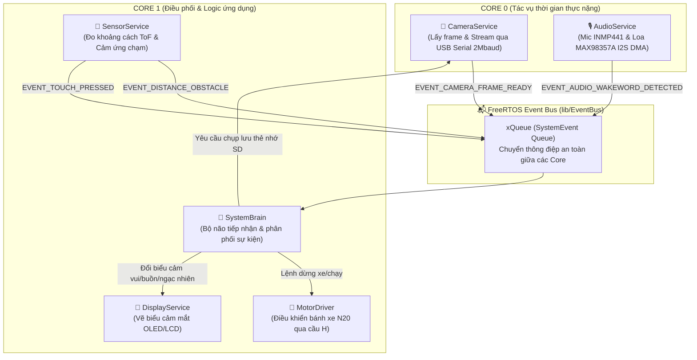

# 🤖 Robot Xiaozhi - ESP32-S3 Firmware (Modular Architecture & Event Bus)

Dự án firmware chuẩn hóa dành cho robot AI **Xiaozhi (小智)** và dòng **DB-Robot Mini (OLED + Camera ESP32-S3)**. Dự án được thiết kế theo **Kiến trúc Module hóa (Modular Architecture)** kết hợp với **Hàng đợi sự kiện thời gian thực (FreeRTOS Event Bus)** trên nền tảng vi điều khiển **ESP32-S3**.

Kiến trúc này cho phép bạn dễ dàng tự do thay đổi, bật/tắt hoặc ghép nối các module linh kiện theo ý muốn mà không làm ảnh hưởng đến luồng xử lý của hệ thống hay làm đơ camera.

---

## 📋 Mục lục
- [1. Tính năng nổi bật](#1-tính-năng-nổi-bật)
- [2. Kiến trúc hệ thống & Đa nhiệm FreeRTOS](#2-kiến-trúc-hệ-thống--đa-nhiệm-freertos)
- [3. Sơ đồ mạch & Bảng chân GPIO](#3-sơ-đồ-mạch--bảng-chân-gpio)
- [4. Cấu trúc thư mục dự án](#4-cấu-trúc-thư-mục-dự-án)
- [5. Hướng dẫn cấu hình & Lắp ghép linh kiện](#5-hướng-dẫn-cấu-hình--lắp-ghép-linh-kiện)
- [6. Hướng dẫn phát triển module mới](#6-hướng-dẫn-phát-triển-module-mới)
- [7. Hướng dẫn cài đặt và nạp firmware](#7-hướng-dẫn-cài-đặt-và-nạp-firmware)
- [8. Ứng dụng xem video trực tiếp (OpenCV Viewer)](#8-ứng-dụng-xem-video-trực-tiếp-opencv-viewer)
- [9. Xử lý sự cố thường gặp (Troubleshooting)](#9-xử-lý-sự-cố-thường-gặp-troubleshooting)

---

## 1. Tính năng nổi bật

* 🧩 **Kiến trúc Component chuẩn PlatformIO (`lib/`)**: Tách biệt hoàn toàn mã nguồn của từng ngoại vi (`EventBus`, `CameraService`, `MotorDriver`, `DisplayService`, `AudioService`, `SensorService`, `SystemBrain`).
* ⚡ **FreeRTOS Event Bus phi chặn (Non-blocking)**: Các module giao tiếp qua hàng đợi sự kiện (Pub/Sub pattern). Camera chụp ảnh, cảm biến quét vật cản hay xe chạy không bao giờ làm nghẽn lẫn nhau.
* 🧠 **Tối ưu Dual-Core 240MHz**:
  * **Core 0**: Chuyên trách truyền stream video Serial tốc độ cao (2Mbaud) và xử lý âm thanh/mạng nặng.
  * **Core 1**: Não bộ điều phối (`SystemBrain`) ra quyết định tức thì khi có sự kiện từ cảm biến.
* 🚀 **Tận dụng 8MB/16MB OPI PSRAM**: Cấp phát Frame Buffer độ phân giải VGA/SVGA trực tiếp trong PSRAM ngoài, giữ cho bộ nhớ RAM nội (SRAM) luôn trống trên 90%.
* 🎛️ **Bật/Tắt module bằng 1 cú nhấp chuột**: Linh kiện nào có sẵn thì bật, chưa mua thì tắt trong `app_config.h` mà không phát sinh lỗi biên dịch.

---

## 2. Kiến trúc hệ thống & Đa nhiệm FreeRTOS



---

## 3. Sơ đồ mạch & Bảng chân GPIO

Sơ đồ chân được chuẩn hóa theo thiết kế mạch **DB-Robot Mini OLED Camera ESP32-S3** (bạn có thể tự do chỉnh lại trong `include/app_config.h`):

| Tên Module | Chân trên Module | Chân GPIO ESP32-S3 | Chức năng |
| :--- | :--- | :---: | :--- |
| **I2C Bus chung** | SCL<br/>SDA | `GPIO 42`<br/>`GPIO 41` | Kết nối màn hình OLED (SSD1306) và Cảm biến khoảng cách laser (VL53L0X) |
| **Động cơ 2 bánh (L298N Mini)** | IN1, IN2<br/>IN3, IN4 | `GPIO 2`, `GPIO 1`<br/>`GPIO 47`, `GPIO 48` | Bánh trái (N20 Left)<br/>Bánh phải (N20 Right) |
| **Cảm biến chạm (TTP223)** | I/O | `GPIO 45` | Cảm ứng chạm trên đỉnh đầu robot để tương tác |
| **Micro I2S (INMP441)** | SCK, WS, SD | `GPIO 43`, `GPIO 44`, `GPIO 1` | Thu âm giọng nói truyền tới AI |
| **Loa I2S (MAX98357A)** | BCLK, LRC, DIN | `GPIO 19`, `GPIO 20`, `GPIO 21` | Khuếch đại âm thanh phát câu trả lời |
| **Đèn LED trang trí** | WS2812 DIN<br/>LED Edison | `GPIO 38`<br/>`GPIO 47` | Hiệu ứng ánh sáng RGB bụng và dây tóc |
| **Thẻ nhớ MicroSD (SD_MMC)** | CLK, CMD, D0 | `GPIO 39`, `GPIO 38`, `GPIO 40` | Lưu ảnh chụp trực tiếp từ camera |
| **Camera OV2640 / OV5640** | D0 - D7, XCLK... | Theo chân socket FPC | Tự động cấu hình trong `camera_pins.h` |

---

## 4. Cấu trúc thư mục dự án

```text
robot_xiaozhi/
├── lib/                             # Thư mục thư viện độc lập (PlatformIO Components)
│   ├── EventBus/                    # Thư viện Hàng đợi sự kiện FreeRTOS
│   │   ├── EventBus.h
│   │   └── EventBus.cpp
│   ├── CameraService/               # Thư viện quản lý Camera & Stream Serial
│   │   ├── CameraService.h
│   │   └── CameraService.cpp
│   ├── SystemBrain/                 # Não bộ điều phối trung tâm
│   │   ├── SystemBrain.h
│   │   └── SystemBrain.cpp
│   ├── MotorDriver/                 # Driver điều khiển động cơ di chuyển
│   │   ├── MotorDriver.h
│   │   └── MotorDriver.cpp
│   ├── DisplayService/              # Dịch vụ hiển thị biểu cảm mắt
│   │   ├── DisplayService.h
│   │   └── DisplayService.cpp
│   ├── AudioService/                # Dịch vụ âm thanh I2S Mic & Loa
│   │   ├── AudioService.h
│   │   └── AudioService.cpp
│   └── SensorService/               # Dịch vụ cảm biến khoảng cách & chạm
│       ├── SensorService.h
│       └── SensorService.cpp
├── include/                         # Header cấu hình dùng chung
│   ├── app_config.h                 # Cấu hình Bật/Tắt module & Sơ đồ chân GPIO
│   └── camera_pins.h                # Định nghĩa chân phần cứng camera ESP32-S3
├── src/
│   └── main.cpp                     # File chính: Khởi động hệ thống & Heartbeat
├── platformio.ini                   # File cấu hình PlatformIO (OPI PSRAM, cờ build)
├── viewer.py                        # Ứng dụng xem Live Video trên máy tính (OpenCV)
├── run_viewer.bat                   # Phím tắt mở nhanh ứng dụng xem video
└── README.md                        # Tài liệu hướng dẫn toàn diện
```

---

## 5. Hướng dẫn cấu hình & Lắp ghép linh kiện

Mở file [`include/app_config.h`](include/app_config.h) để tùy biến:

### 1. Bật hoặc tắt module tùy theo tiến độ hàn linh kiện:
```cpp
#define ENABLE_MODULE_CAMERA    1   // 1 = Bật camera, 0 = Tắt
#define ENABLE_MODULE_SD_CARD   1   // 1 = Bật thẻ nhớ, 0 = Tắt
#define ENABLE_MODULE_BRAIN     1   // 1 = Bật não bộ điều phối EventBus

// Bật 1 khi bạn gắn thêm linh kiện:
#define ENABLE_MODULE_DISPLAY   0   // Màn hình OLED / LCD
#define ENABLE_MODULE_MOTOR     0   // Động cơ bánh xe
#define ENABLE_MODULE_AUDIO     0   // Micro & Loa I2S
#define ENABLE_MODULE_SENSOR    0   // Cảm biến khoảng cách & Chạm
```

### 2. Thay đổi chân GPIO phù hợp với cách bạn đi dây:
```cpp
#define PIN_I2C_SDA             41
#define PIN_I2C_SCL             42
#define PIN_MOTOR_LEFT_IN1      2
#define PIN_MOTOR_LEFT_IN2      1
...
```

---

## 6. Hướng dẫn phát triển module mới

Để thêm một tính năng hoặc phản ứng mới cho robot:

1. **Thêm Event mới** vào enum `EventType` trong [`lib/EventBus/EventBus.h`](lib/EventBus/EventBus.h):
   ```cpp
   enum EventType {
       ...
       EVENT_BATTERY_CHARGING,
   };
   ```
2. **Gửi sự kiện từ bất kỳ đâu (Non-blocking)**:
   ```cpp
   EventBus::postType(EVENT_BATTERY_CHARGING);
   ```
3. **Xử lý sự kiện trong Não bộ** tại [`lib/SystemBrain/SystemBrain.cpp`](lib/SystemBrain/SystemBrain.cpp):
   ```cpp
   case EVENT_BATTERY_CHARGING:
       DisplayService::setEmotion(EMOTION_HAPPY);
       break;
   ```

---

## 7. Hướng dẫn cài đặt và nạp firmware

### Yêu cầu môi trường:
* Cài đặt **[Visual Studio Code](https://code.visualstudio.com/)**.
* Cài đặt Extension **[PlatformIO IDE](https://marketplace.visualstudio.com/items?itemName=platformio.platformio-ide)**.

### Các bước nạp code:
1. Mở thư mục `robot_xiaozhi` trong VS Code.
2. Cắm mạch ESP32-S3-CAM vào máy tính qua cổng Type-C.
3. Nhấn biểu tượng **Check (✔)** ở thanh dưới cùng để Biên dịch (Build).
4. Nhấn biểu tượng **Mũi tên (➡)** để Nạp Firmware (Upload).

---

## 8. Ứng dụng xem video trực tiếp (OpenCV Viewer)

Dự án đi kèm công cụ `viewer.py` nhận stream video thời gian thực từ ESP32-S3 qua cổng USB Serial với tốc độ cao (2.000.000 baud):

### Khởi chạy:
* **Cách 1**: Nhấp đúp vào file [`run_viewer.bat`](run_viewer.bat).
* **Cách 2**: Chạy lệnh terminal:
  ```bash
  python viewer.py
  ```

### Phím tắt điều khiển trên giao diện video:
* `S`: Chụp và lưu ảnh về thư mục `captures/` trên máy tính.
* `C`: Gửi sự kiện yêu cầu robot chụp ảnh lưu vào thẻ MicroSD gắn trên mạch.
* `1` / `2` / `3`: Chuyển đổi nhanh độ phân giải (QVGA 320x240 / VGA 640x480 / SVGA 800x600).
* `Q` hoặc `ESC`: Đóng chương trình xem video.

---

## 9. Xử lý sự cố thường gặp (Troubleshooting)

| Sự cố | Nguyên nhân | Giải pháp |
| :--- | :--- | :--- |
| **`Camera init failed!`** | Cáp FPC của camera gắn lỏng hoặc lệch chân. | Tháo chốt cài FPC, căn chỉnh lại cáp camera và cài chặt lại. |
| **`CANH BAO: PSRAM khong tim thay!`** | Chọn sai loại board hoặc cấu hình OPI PSRAM chưa nhận. | Kiểm tra dòng `board_build.arduino.memory_type = qio_opi` trong `platformio.ini`. Đảm bảo mạch của bạn là bản N8R8 hoặc N16R8. |
| **Xe không chạy hoặc tự reset khi bật motor** | Động cơ N20 ăn dòng gây sụt áp nguồn 3.3V/5V của ESP32. | Hàn tụ lọc nguồn (470uF - 1000uF) vào đường nguồn cấp cho mạch cầu H và vi điều khiển như trên sơ đồ mạch. |

---

## 📄 Giấy phép (License)
Dự án được phát hành theo giấy phép mã nguồn mở **MIT License**.
