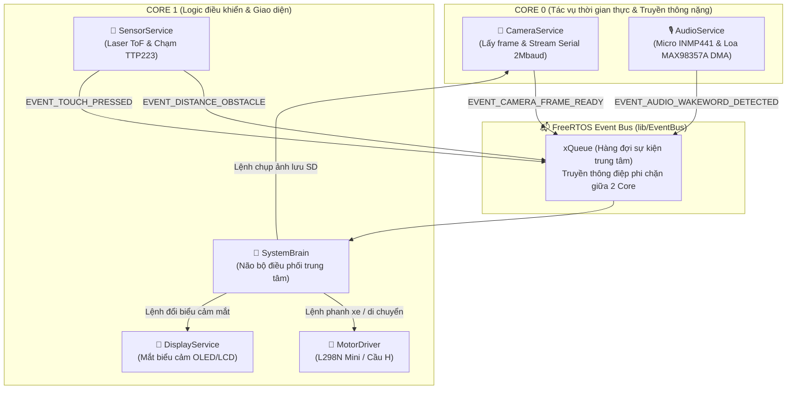

# 🤖 Robot Xiaozhi (小智) - Firmware ESP32-S3 (Modular & Event Bus Architecture)

> 👤 **Tác giả / Bản quyền**: **Phương Nam (`phuongnam`)**  
> ⚠️ **Bản quyền sở hữu trí tuệ**: Toàn bộ kiến trúc và mã nguồn dự án thuộc quyền sở hữu độc quyền của **Phương Nam (`phuongnam`)**.  
> 🔒 **Mọi hành vi sao chép, trích xuất, chỉnh sửa hoặc sử dụng dự án cho mục đích cá nhân hoặc thương mại BẮT BUỘC PHẢI XIN PHÉP VÀ ĐƯỢC SỰ ĐỒNG Ý CỦA TÁC GIẢ.**

---

## 📋 Mục lục chi tiết
1. [Giới thiệu tổng quan dự án](#1-giới-thiệu-tổng-quan-dự-án)
2. [Nguyên lý kiến trúc: Dual-Core, OPI PSRAM & Event Bus](#2-nguyên-lý-kiến-trúc-dual-core-opi-psram--event-bus)
3. [Sơ đồ khối phần cứng & Bảng chân kết nối GPIO](#3-sơ-đồ-khối-phần-cứng--bảng-chân-kết-nối-gpio)
4. [Cấu trúc mã nguồn & Chi tiết các thư viện trong `lib/`](#4-cấu-trúc-mã-nguồn--chi-tiết-các-thư-viện-trong-lib)
5. [Hướng dẫn cấu hình Bật/Tắt module (`include/app_config.h`)](#5-hướng-dẫn-cấu-hình-bậttắt-module-includeapp_configh)
6. [Hướng dẫn cơ chế giao tiếp Event Bus (Cách thêm tính năng mới)](#6-hướng-dẫn-cơ-chế-giao-tiếp-event-bus-cách-thêm-tính-năng-mới)
7. [Hướng dẫn cài đặt môi trường và Nạp Firmware](#7-hướng-dẫn-cài-đặt-môi-trường-và-nạp-firmware)
8. [Hướng dẫn sử dụng Live Video Viewer trên máy tính](#8-hướng-dẫn-sử-dụng-live-video-viewer-trên-máy-tính)
9. [Lộ trình tích hợp AI Cloud (Xiaozhi Server / OpenAI / Dify)](#9-lộ-trình-tích-hợp-ai-cloud-xiaozhi-server--openai--dify)
10. [Bảng xử lý sự cố thường gặp (Troubleshooting)](#10-bảng-xử-lý-sự-cố-thường-gặp-troubleshooting)

---

## 1. Giới thiệu tổng quan dự án

**Robot Xiaozhi** là mô hình robot để bàn thông minh, kết hợp giữa:
* **Thị giác máy tính (Computer Vision)**: Nhận diện khuôn mặt, vật thể, quét QR code và truyền video thời gian thực.
* **Tương tác âm thanh (Voice AI)**: Thu âm giọng nói qua micro số I2S, truyền lên server AI (Xiaozhi / LLM) và phát âm thanh phản hồi qua loa.
* **Cảm xúc & Biểu cảm**: Màn hình OLED hiển thị đôi mắt chớp nháy sống động biểu thị các trạng thái: vui, buồn, ngạc nhiên, suy nghĩ, tức giận.
* **Di chuyển linh hoạt**: Hệ dẫn động 2 bánh vi sai sử dụng động cơ giảm tốc N20 mini và mạch cầu H, tích hợp cảm biến laser ToF chống va chạm và chống rơi bàn.

Dự án này được tổ chức lại toàn bộ để bạn **có thể tự do mua sắm và lắp linh kiện theo ý muốn**. Bạn lắp đến đâu chỉ cần bật module đó trong cấu hình đến đó.

---

## 2. Nguyên lý kiến trúc: Dual-Core, OPI PSRAM & Event Bus

### A. Phân bổ 2 Nhân CPU (Dual-Core Xtensa LX7 @ 240MHz)
Thay vì nhồi nhét tất cả code vào một vòng lặp `loop()` gây nghẽn và giật khung hình, hệ thống chia việc cho 2 nhân xử lý độc lập:
* **Core 0 (Multimedia & I/O nặng)**:
  * Chạy **`CameraService Task`**: Lấy dữ liệu từ cảm biến ảnh (OV2640), nén JPEG và truyền gói tin tốc độ cao qua Serial USB (2.000.000 baud).
  * Chạy **`AudioService Task`** (khi bật): Xử lý DMA truyền nhận luồng âm thanh I2S với micro và loa.
* **Core 1 (Logic điều phối & Ngoại vi tương tác)**:
  * Chạy **`SystemBrain Task`**: Tiếp nhận các sự kiện từ Event Bus, đưa ra quyết định (ví dụ: gặp vật cản thì phanh xe và đổi mắt OLED).
  * Chạy điều khiển động cơ, quét nút cảm ứng chạm và cập nhật màn hình.



### B. Bộ nhớ mở rộng OPI PSRAM (Octal SPI)
* Vi điều khiển ESP32-S3 tích hợp sẵn **8MB hoặc 16MB PSRAM** giao tiếp bus Octal 8-bit tốc độ cao.
* Cấu hình trong `platformio.ini` (`board_build.arduino.memory_type = qio_opi` và `BOARD_HAS_PSRAM`) cho phép toàn bộ Frame Buffer của camera (độ phân giải VGA 640x480 hoặc SVGA 800x600) được lưu thẳng trên PSRAM.
* Bộ nhớ RAM nội (SRAM 512KB) của chip luôn được giữ an toàn ở mức **trống trên 90%**, không bao giờ bị tràn bộ nhớ (`out of memory`).

---

## 3. Sơ đồ khối phần cứng & Bảng chân kết nối GPIO

Sơ đồ chân được chuẩn hóa theo mẫu **DB-Robot Mini OLED Camera ESP32-S3** (bạn có thể thay đổi tùy ý trong [`include/app_config.h`](include/app_config.h)):

| Tên Khối Ngoại Vi | Module Thực Tế Khuyên Dùng | Chân Trên Module | Chân GPIO ESP32-S3 | Ghi Chú Kỹ Thuật |
| :--- | :--- | :--- | :---: | :--- |
| **Camera Mắt Nhìn** | OV2640 / OV5640 FPC | D0-D7, XCLK, PCLK... | Chân ngầm FPC | Đã khai báo chuẩn trong `include/camera_pins.h` |
| **Bus I2C Chung** | Màn hình OLED & Laser ToF | SCL<br/>SDA | **GPIO 42**<br/>**GPIO 41** | Dùng chung 1 đường I2C (OLED địa chỉ `0x3C`, VL53L0X địa chỉ `0x29`) |
| **Động Cơ Bánh Xe** | L298N Mini / DRV8833 + 2x N20 | IN1, IN2<br/>IN3, IN4 | **GPIO 2, GPIO 1**<br/>**GPIO 47, GPIO 48** | Điều khiển bánh trái (Motor A) và bánh phải (Motor B) |
| **Cảm Biến Chạm** | TTP223 Mini | I/O | **GPIO 45** | Đặt dưới vỏ đầu robot, xoa đầu để đánh thức / gọi AI |
| **Micro I2S** | INMP441 Omnidirectional | SCK, WS, SD | **GPIO 43, GPIO 44, GPIO 1** | Micro MEMS độ nhạy cao thu âm giọng nói |
| **Loa I2S** | MAX98357A Amp + Loa 3W | BCLK, LRC, DIN | **GPIO 19, GPIO 20, GPIO 21** | Mạch giải mã DAC và khuếch đại âm thanh số I2S |
| **Đèn LED Hiệu Ứng** | WS2812B RGB / LED Edison | DIN / Anode | **GPIO 38** / **GPIO 47** | Tạo hiệu ứng ánh sáng đổi màu theo cảm xúc |
| **Thẻ Nhớ Lưu Ảnh** | MicroSD Slot (SD_MMC) | CLK, CMD, D0 | **GPIO 39, GPIO 38, GPIO 40** | Chế độ SD-MMC 1-bit tốc độ cao lưu ảnh chụp |
| **Nguồn Điện** | Pin 14250 3.7V + Sạc V713 | 5V, GND | 5V, GND | Cần gắn tụ hóa (470uF - 1000uF) lọc sụt áp khi khởi động motor |

---

## 4. Cấu trúc mã nguồn & Chi tiết các thư viện trong `lib/`

Dự án tuân thủ tiêu chuẩn **PlatformIO Component Library Architecture**, mã nguồn được chia thành các thư viện khép kín đặt trong thư mục `lib/`:

```text
robot_xiaozhi/
├── lib/                             # 📦 Thư mục thư viện thành phần độc lập
│   ├── EventBus/                    # 📬 Hàng đợi sự kiện FreeRTOS toàn hệ thống
│   │   ├── EventBus.h               # Định nghĩa các EventType và API Post/Receive
│   │   └── EventBus.cpp             # Hiện thực hàng đợi xQueue phi chặn
│   ├── CameraService/               # 📷 Quản lý Camera & Stream Serial 2Mbaud
│   │   ├── CameraService.h
│   │   └── CameraService.cpp        # Chạy Task trên Core 0, gửi frame JPEG cho PC
│   ├── SystemBrain/                 # 🧠 Não bộ điều phối trung tâm
│   │   ├── SystemBrain.h
│   │   └── SystemBrain.cpp          # Chạy Task trên Core 1, phân phối sự kiện
│   ├── MotorDriver/                 # 🚗 Driver điều khiển bánh xe N20 (Tiến/Lùi/Rẽ/Dừng)
│   │   ├── MotorDriver.h
│   │   └── MotorDriver.cpp
│   ├── DisplayService/              # 👀 Quản lý biểu cảm đôi mắt OLED / LCD
│   │   ├── DisplayService.h
│   │   └── DisplayService.cpp
│   ├── AudioService/                # 🎙️ Dịch vụ âm thanh I2S thu Mic & phát Loa
│   │   ├── AudioService.h
│   │   └── AudioService.cpp
│   └── SensorService/               # 📡 Quản lý cảm biến khoảng cách VL53L0X & Chạm TTP223
│       ├── SensorService.h
│       └── SensorService.cpp
├── include/                         # ⚙️ Cấu hình toàn cục
│   ├── app_config.h                 # Công tắc BẬT/TẮT module & Bảng phân bổ chân GPIO
│   └── camera_pins.h                # Định nghĩa chân phần cứng cảm biến camera
├── src/
│   └── main.cpp                     # 🚀 File chính: Khởi động hệ thống & Giám sát RAM
├── platformio.ini                   # File cấu hình PlatformIO (OPI PSRAM, Flash 8MB, Baudrate)
├── viewer.py                        # Ứng dụng xem Live Video trên PC bằng OpenCV
├── run_viewer.bat                   # File bấm đúp chuột mở nhanh Live Video Viewer
└── README.md                        # Tài liệu hướng dẫn toàn diện
```

---

## 5. Hướng dẫn cấu hình Bật/Tắt module (`include/app_config.h`)

File [`include/app_config.h`](include/app_config.h) là nơi duy nhất bạn cần quan tâm khi lắp ráp phần cứng:

### 1. Bật/Tắt module theo linh kiện bạn đang có sẵn:
```cpp
// 1 = Bật module (Tự động tạo Task và xử lý)
// 0 = Tắt module (Không chiếm chân, không tốn RAM)

#define ENABLE_MODULE_CAMERA    1   // Bật camera (đang có sẵn trên mạch)
#define ENABLE_MODULE_SD_CARD   1   // Bật thẻ nhớ lưu ảnh
#define ENABLE_MODULE_BRAIN     1   // Bật não bộ điều phối EventBus

// Các module bạn sẽ gắn thêm sau:
#define ENABLE_MODULE_DISPLAY   0   // Đổi thành 1 khi bạn hàn màn hình OLED
#define ENABLE_MODULE_MOTOR     0   // Đổi thành 1 khi bạn nối mạch cầu H motor
#define ENABLE_MODULE_AUDIO     0   // Đổi thành 1 khi bạn hàn Mic & Loa I2S
#define ENABLE_MODULE_SENSOR    0   // Đổi thành 1 khi bạn hàn cảm biến ToF / Chạm
```

### 2. Tự do đổi chân GPIO theo cách bạn đi dây thực tế:
Nếu cách hàn của bạn khác sơ đồ mẫu, chỉ cần sửa số chân trong file này:
```cpp
#define PIN_MOTOR_LEFT_IN1      2   // Chân IN1 cầu H
#define PIN_MOTOR_LEFT_IN2      1   // Chân IN2 cầu H
#define PIN_I2C_SDA             41  // Chân Data I2C
#define PIN_I2C_SCL             42  // Chân Clock I2C
#define PIN_TOUCH_SENSOR        45  // Chân tín hiệu nút chạm
```

---

## 6. Hướng dẫn cơ chế giao tiếp Event Bus (Cách thêm tính năng mới)

Cơ chế Event Bus giúp bạn viết thêm chức năng mới cực kỳ đơn giản theo 3 bước:

### Bước 1: Khai báo Event mới
Mở [`lib/EventBus/EventBus.h`](lib/EventBus/EventBus.h) và thêm sự kiện vào enum `EventType`:
```cpp
enum EventType {
    ...
    EVENT_BATTERY_LOW,        // Thêm sự kiện: Pin yếu
    EVENT_ROBOT_PICKED_UP,    // Thêm sự kiện: Robot bị nhấc bổng khỏi bàn
};
```

### Bước 2: Bắn sự kiện từ nơi phát hiện (Producer)
Ở bất kỳ đâu (task cảm biến, ngắt GPIO...), bạn chỉ cần gọi 1 dòng:
```cpp
EventBus::postType(EVENT_ROBOT_PICKED_UP);

// Hoặc gửi kèm dữ liệu (ví dụ khoảng cách cm):
SystemEvent evt;
evt.type = EVENT_DISTANCE_OBSTACLE;
evt.param.i32 = 8; // cách vật cản 8cm
EventBus::post(evt);
```

### Bước 3: Đón nhận và xử lý trong Não bộ (Consumer)
Mở [`lib/SystemBrain/SystemBrain.cpp`](lib/SystemBrain/SystemBrain.cpp) và thêm khối `case`:
```cpp
case EVENT_ROBOT_PICKED_UP:
    MotorDriver::stop();                         // Dừng động cơ ngay
    DisplayService::setEmotion(EMOTION_ANGRY);   // Mắt tức giận vì bị nhấc lên
    AudioService::playSound("put_me_down.mp3");  // Phát câu thoại qua loa
    break;
```

---

## 7. Hướng dẫn cài đặt môi trường và Nạp Firmware

### Bước 1: Cài đặt phần mềm cần thiết
1. Tải và cài đặt **[VS Code (Visual Studio Code)](https://code.visualstudio.com/)**.
2. Trong VS Code, mở tab Extensions (`Ctrl + Shift + X`), tìm và cài đặt **PlatformIO IDE**.
3. Cài đặt Python 3 trên máy tính (nếu muốn dùng script xem camera `viewer.py`):
   ```bash
   pip install opencv-python numpy pyserial
   ```

### Bước 2: Mở dự án và Biên dịch
1. Khởi động VS Code -> Chọn **File** -> **Open Folder...** -> Chọn thư mục `robot_xiaozhi`.
2. Chờ PlatformIO tự động quét thư viện trong `lib/` (thấy thông báo *PlatformIO: Ready* ở thanh dưới cùng).
3. Nhấn biểu tượng dấu **Tích (✔)** ở thanh trạng thái để biên dịch dự án.

### Bước 3: Nạp Firmware vào ESP32-S3
1. Cắm cáp USB Type-C từ máy tính vào cổng USB/UART trên mạch ESP32-S3.
2. Nhấn biểu tượng **Mũi tên sang phải (➡)** trên thanh công cụ của PlatformIO để nạp code.
3. Khi nạp xong, thông báo **`SUCCESS`** sẽ xuất hiện trên Terminal.

---

## 8. Hướng dẫn sử dụng Live Video Viewer trên máy tính

Dự án đi kèm ứng dụng xem video mượt mà viết bằng Python & OpenCV:

### Khởi chạy:
* **Cách 1**: Nhấp đúp chuột vào file [`run_viewer.bat`](run_viewer.bat).
* **Cách 2**: Chạy qua dòng lệnh Terminal:
  ```bash
  python viewer.py
  ```
  *(Script sẽ tự động dò tìm cổng COM của ESP32-S3 và mở luồng video 2.000.000 baud).*

### Phím tắt điều khiển trong cửa sổ video:
* `S`: Chụp ảnh và lưu về thư mục `captures/` trên máy tính.
* `C`: Gửi tín hiệu qua Serial để ESP32-S3 chụp và lưu ảnh vào thẻ nhớ MicroSD trên mạch.
* `1`: Đổi sang độ phân giải **QVGA (320x240)** - Tốc độ khung hình cao nhất.
* `2`: Đổi sang độ phân giải **VGA (640x480)** - Cân bằng độ nét và tốc độ (Khuyên dùng).
* `3`: Đổi sang độ phân giải **SVGA (800x600)** - Độ nét cao.
* `Q` hoặc `ESC`: Thoát ứng dụng.

---

## 9. Lộ trình tích hợp AI Cloud (Xiaozhi Server / OpenAI / Dify)

Kiến trúc này đã sẵn sàng để bạn tích hợp luồng đàm thoại với AI:
1. **Kết nối WiFi**: Thêm thư viện `WiFi.h` và `WebSocketsClient` vào `lib/NetworkService`.
2. **Truyền nhận Audio**:
   * Khi người dùng nhấn nút chạm `TTP223` -> Bắn sự kiện `EVENT_TOUCH_PRESSED`.
   * `AudioService` bắt đầu đọc dữ liệu PCM từ Micro `INMP441` và stream qua WebSocket lên server Xiaozhi.
3. **Phản hồi từ AI**:
   * Server trả về câu trả lời -> Bắn sự kiện `EVENT_AI_RESPONSE_RECEIVED`.
   * `SystemBrain` gửi chuỗi text ra `DisplayService` (hiển thị phụ đề) và đẩy dữ liệu âm thanh ra `AudioService` (phát ra loa `MAX98357A`).

---

## 10. Bảng xử lý sự cố thường gặp (Troubleshooting)

| Tình trạng sự cố | Nguyên nhân khả dĩ | Hướng dẫn khắc phục |
| :--- | :--- | :--- |
| **`Camera init failed!`** | Cáp FPC camera tiếp xúc không tốt hoặc lỏng chân. | Mở lẫy gài cáp camera trên mạch, cắm sâu đầu cáp thẳng hàng và gài chặt lại. |
| **`CANH BAO: PSRAM khong tim thay!`** | Mạch không có PSRAM hoặc cấu hình chế độ OPI sai. | Kiểm tra mã chip (phải là `N8R8` hoặc `N16R8`). Đảm bảo file `platformio.ini` có dòng `board_build.arduino.memory_type = qio_opi`. |
| **Xe giật hoặc tự Reset khi bật động cơ** | Động cơ N20 kéo dòng lớn gây sụt áp đường 3.3V/5V. | Hàn thêm tụ hóa `470uF - 1000uF` vào giữa chân 5V và GND của mạch như trong sơ đồ. |
| **Màn hình OLED không sáng** | Sai địa chỉ I2C hoặc lỏng dây SDA/SCL. | Kiểm tra chân SDA (GPIO 41) và SCL (GPIO 42). Địa chỉ màn hình mặc định thường là `0x3C`. |
| **Không in log ra cổng Type-C** | Chưa kích hoạt chế độ USB CDC trên ESP32-S3. | Mạch đã có cờ `-D ARDUINO_USB_CDC_ON_BOOT=1` trong cấu hình, đảm bảo cắm đúng cổng USB Native CDC. |

---

## 📄 Bản quyền & Điều khoản sử dụng (Copyright & License)

**© 2026 Bản quyền thuộc về Phương Nam (`phuongnam`). Tất cả các quyền được bảo lưu (All Rights Reserved).**

* **Tác giả / Sở hữu trí tuệ**: **Phương Nam (`phuongnam`)**
* **Điều kiện sử dụng**:
  * Toàn bộ mã nguồn, cấu trúc firmware, tài liệu thiết kế và các module trong dự án này là tài sản trí tuệ độc quyền của tác giả.
  * **NGHIÊM CẤM** mọi hành vi sao chép, trích xuất, phân phối lại, sửa đổi hoặc sử dụng cho mục đích cá nhân, học tập hoặc thương mại dưới mọi hình thức khi **CHƯA CÓ SỰ ĐỒNG Ý VÀ CHO PHÉP CHÍNH THỨC TỪ TÁC GIẢ**.
  * Mọi nhu cầu liên hệ hợp tác, tham khảo hoặc xin cấp quyền sử dụng dự án, vui lòng liên hệ trực tiếp với tác giả **Phương Nam (`phuongnam`)**.
