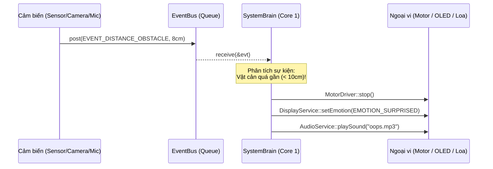

# 🧠 Component `SystemBrain` - Não Bộ Điều Phối Trung Tâm

Component `SystemBrain` đóng vai trò là **Bộ não trung tâm** điều phối toàn bộ hành vi và phản ứng của Robot Xiaozhi. Module này chạy trong một Task FreeRTOS độc lập trên **Core 1**, liên tục lắng nghe hàng đợi `EventBus` và ra quyết định chỉ đạo các module ngoại vi khác.

---

## 📂 Các file trong component
* [`SystemBrain.h`](SystemBrain.h): Khai báo hàm khởi chạy Não bộ `SystemBrain::init()`.
* [`SystemBrain.cpp`](SystemBrain.cpp): Hiện thực máy trạng thái (State Machine) xử lý sự kiện và dispatch lệnh tới các driver.

---

## 🔄 Luồng hoạt động của Não bộ



---

## 📋 Bảng ánh xạ Sự kiện -> Hành vi hiện tại

| Sự kiện nhận được | Hành động của Não bộ | Ngoại vi thực thi |
| :--- | :--- | :--- |
| `EVENT_SYSTEM_BOOT_COMPLETED` | Bật mắt robot ở trạng thái bình thường (chớp mắt nhẹ nhàng). | `DisplayService::setEmotion(EMOTION_NORMAL)` |
| `EVENT_CAMERA_CAPTURE_REQUEST` | Ra lệnh chụp ảnh và lưu vào thẻ nhớ MicroSD. | `CameraService::requestCapture()` |
| `EVENT_TOUCH_PRESSED` | Người dùng xoa đầu: Đổi mắt sang cười vui vẻ và phát âm thanh chào mừng. | `DisplayService::setEmotion(EMOTION_HAPPY)`<br/>`AudioService::playSound("happy.mp3")` |
| `EVENT_DISTANCE_OBSTACLE` | Gặp vật cản phía trước: Dừng xe ngay lập tức, đổi mắt sang ngạc nhiên/hoảng hốt. | `MotorDriver::stop()`<br/>`DisplayService::setEmotion(EMOTION_SURPRISED)` |
| `EVENT_MOTOR_MOVE_FORWARD` | Cho robot tiến về phía trước theo tốc độ chỉ định. | `MotorDriver::forward(speed)` |
| `EVENT_MOTOR_STOP` | Dừng hẳn 2 bánh xe. | `MotorDriver::stop()` |

---

## 💡 Cách bổ sung thêm phản xạ/hành vi mới
Để dạy robot phản ứng với tình huống mới, bạn chỉ cần mở file [`SystemBrain.cpp`](SystemBrain.cpp) và thêm 1 khối `case`:

```cpp
case EVENT_BATTERY_LOW:
    // Khi pin yếu:
    MotorDriver::stop(); // Dừng xe để tiết kiệm pin
    DisplayService::setEmotion(EMOTION_SAD); // Mắt buồn
    AudioService::playSound("low_battery.mp3"); // Thông báo cần cắm sạc
    break;
```
